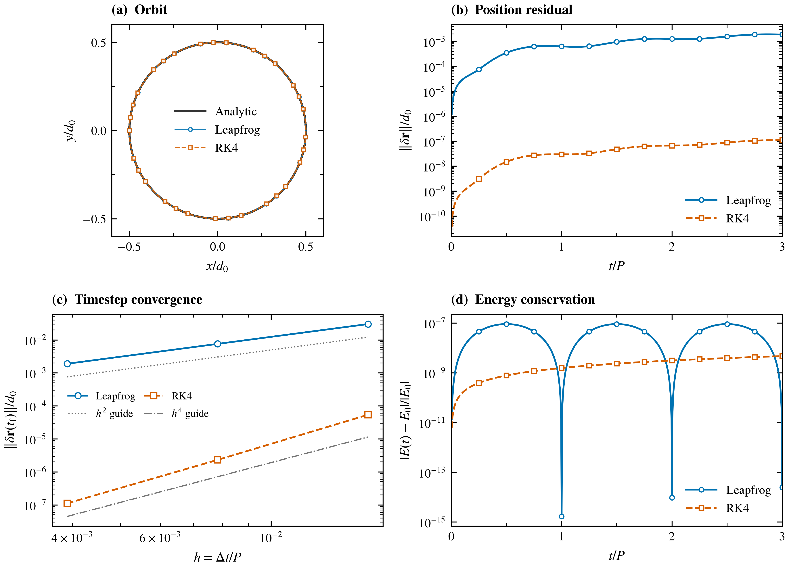
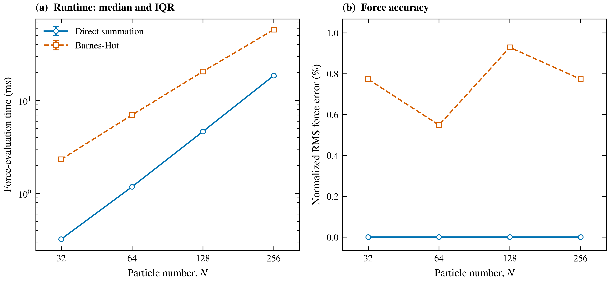

# Celestial Waltz

A Python N-body toolkit for exploring **numerical accuracy and computational
cost in Newtonian gravity**. The CPU core uses only the standard library. It
includes direct summation, a Barnes–Hut octree, leapfrog and RK4 integration,
reproducible force benchmarks, and an analytic two-body validation experiment.



**Figure 1. Circular-binary verification.** Leapfrog and RK4 compared with an
analytic orbit: geometry, position residuals, timestep convergence, and energy
conservation. The reference slopes are guides, not fitted results; exact zeros
are omitted on logarithmic axes. See the [full caption](examples/validation/validation.caption.txt),
[vector PDF](examples/validation/validation.pdf), and [experiment data](examples/validation/report.json).
The [numerical methods notes](docs/numerical-methods.md) define the experiment,
acceptance criteria, measured results, and limitations.

## Install

Python 3.10 or later is required. From this repository on Windows PowerShell:

```powershell
python -m venv .venv
.\.venv\Scripts\python.exe -m pip install -e ".[plot]"
.\.venv\Scripts\celestial-waltz.exe validate --plot
```

On Linux or macOS:

```bash
python3 -m venv .venv
.venv/bin/python -m pip install -e '.[plot]'
.venv/bin/celestial-waltz validate --plot
```

The `plot` extra is optional. `pip install -e .` installs the dependency-free
CPU core; validation without `--plot` still writes all numerical results.
After activating the environment, the commands below are available directly.
They also work as `python -m celestial_waltz ...`.

## Reproduce a scientific check

```bash
celestial-waltz validate --output results/two-body --plot
```

This evolves an equal-mass circular binary for three orbits at 64, 128, and 256
steps per orbit. It compares numerical trajectories with the analytic orbit,
measures energy and momentum errors, and estimates the convergence order of
leapfrog and RK4. A failing check returns a nonzero exit status.

Outputs include `report.json`, `convergence.csv`, and raw trajectories at the
finest resolution. With `--plot`, the command also writes PDF, SVG, and 600 dpi
PNG figures, a standalone caption, and a figure provenance manifest. To run a
new experiment and replace the checked-in measurements:

```bash
celestial-waltz validate --output examples/validation --plot
```

## Run a seeded simulation

```bash
celestial-waltz simulate --particles 100 --steps 100 --seed 42 --mode bh --integrator leapfrog --output results/simulation.json
```

The JSON file contains configuration, final particle states, package/Python
versions, and conservation diagnostics. Reusing a seed reproduces the initial
conditions; wall-clock timings vary. `--particles` is the count **per galaxy**
when `--initial two_galaxies` is selected.

```python
from celestial_waltz import BarnesHutSimulation, Particle

sim = BarnesHutSimulation(
    particles=[
        Particle(-0.5, 0, 0, 0, -0.5, 0, mass=0.5),
        Particle(0.5, 0, 0, 0, 0.5, 0, mass=0.5),
    ],
    dt=0.01, eps=0, mode="direct", integrator="leapfrog",
)
diagnostics = sim.run(1000, verbose=False)
```

Supplied particles are copied so an experiment does not modify its input fixture.
Legacy imports such as `from nbody import BarnesHutSimulation` continue to work.

## Measure accuracy and runtime

```bash
celestial-waltz benchmark --counts 32 64 128 256 --repeats 5 --seed 42 --theta 0.5 --output results/benchmark --plot
```

Both solvers receive the same seeded positions and masses. Total mass stays
fixed as particle count changes. The benchmark measures **acceleration
evaluation**, including tree construction, and records repeated timings and
force error against direct summation. It excludes integration, rendering, and
GPU execution. Raw timings and environment metadata are saved for inspection.
Vary `--theta` to study accuracy versus cost. Small systems may favor direct
summation; no speedup is assumed. `python benchmark.py` also works.



**Figure 2. CPU force-evaluation cost and accuracy.** Runtime markers show
medians and bars span the 25th–75th percentiles of repeated timings. These bars
describe execution variability. The second panel shows deterministic force
error relative to direct summation. Direct summation is faster for these small
recorded systems; no asymptotic speedup is inferred. See the
[full caption](examples/force-benchmark/benchmark.caption.txt),
[vector PDF](examples/force-benchmark/benchmark.pdf), and
[raw timings](examples/force-benchmark/raw_timings.csv).

## Scientific figures

Regenerate figures from saved measurements without rerunning either experiment:

```bash
celestial-waltz figures --validation examples/validation --benchmark examples/force-benchmark
```

Add `--output results/figures` to put the new exports in a separate directory.
Rendering preserves the original CSV/JSON measurements and their solver
identity. Each figure manifest records source-file hashes, rendering-code
hashes, physical dimensions, and the plotting environment.

The shared house style uses fixed journal-scale dimensions, mathematical
labels, restrained colors, and distinct markers and line patterns. PDF embeds
fonts; SVG retains editable text; PNG is exported at 600 dpi. Captions state
the model, parameters, normalization, aggregation, and limitations. The
[figure guide](docs/figure-guide.md) explains the design and how to adapt it to
a specific journal's requirements.

## Model and scope

- Units are dimensionless with **G = 1**. Time is not automatically in Myr.
- Both CPU solvers use the same Plummer-softened interaction. `eps=0` selects
  unsoftened gravity; coincident particles then raise an error.
- Barnes–Hut uses cell width divided by unsoftened distance for its opening
  criterion. `theta=0` opens every internal node. Nodes containing the target
  are opened to avoid including its own mass in an approximation.
- Leapfrog is the default. The legacy `euler` option is **symplectic Euler
  (kick then drift)**, and `rk4` is classical fourth-order Runge–Kutta.
- The `plummer` initializer samples the isotropic continuum Plummer distribution
  in positions and velocities. A finite sample with softened forces is not an
  exact equilibrium. Generated particles have mass one, so total mass grows with N.
- Spiral, legacy `kuzmin`, and two-galaxy generators are **illustrative initial
  states**, not validated equilibrium galaxy models.
  `kuzmin` retains its historical API name but samples exponential radii
  rather than the analytic Kuzmin distribution.
- Approximate tree forces do not guarantee exact momentum conservation.
  Direct two-body verification does not validate arbitrary galaxy trajectories,
  close encounters, or scientific conclusions about real galaxies.

The [physics verification report](docs/physics-verification.md) explains the
force–potential consistency checks, eccentric unequal-mass Kepler tests,
conservation and symmetry checks, Plummer sampling, and supported physical scope.

## Optional visualization and tensors

The original Tkinter viewer is available from the source checkout:

```bash
python galaxy_gui.py
```

Historical galaxy images and animation scripts remain as illustrations. They
are not evidence of the corrected solver's accuracy.

The experimental tensor backend requires PyTorch (`pip install -e '.[gpu]'`;
choose an appropriate PyTorch build for CUDA). A modest demonstration is:

```bash
python gpu_sim.py --particles 1000 --iterations 100 --mode bh
```

Its direct solver allocates quadratic pairwise tensors. Its tree traverses Python
objects, so GPU use alone does not imply a speedup. Optional tests compare tensor
and reference calculations on CPU; actual CUDA execution requires suitable hardware.

## Development

```bash
python -m unittest discover -s tests -v
```

Tests cover analytic forces, conservation, timestep convergence, tree agreement,
unequal-mass eccentric orbits, multiscale separations, Plummer distribution
moments, collision centers, seeded runs, CLI output, and benchmarks.
Figure tests check physical export sizes, median/IQR calculations, preservation
of raw measurements, and plotting-state isolation. Tensor and figure tests skip
when their optional dependencies are absent. GitHub Actions is configured for
Windows/Linux on Python 3.10/3.12, with separate PyTorch CPU and figure-export jobs.

See [CONTRIBUTING.md](CONTRIBUTING.md) and [CHANGELOG.md](CHANGELOG.md).
This project uses the [MIT license](LICENSE).
