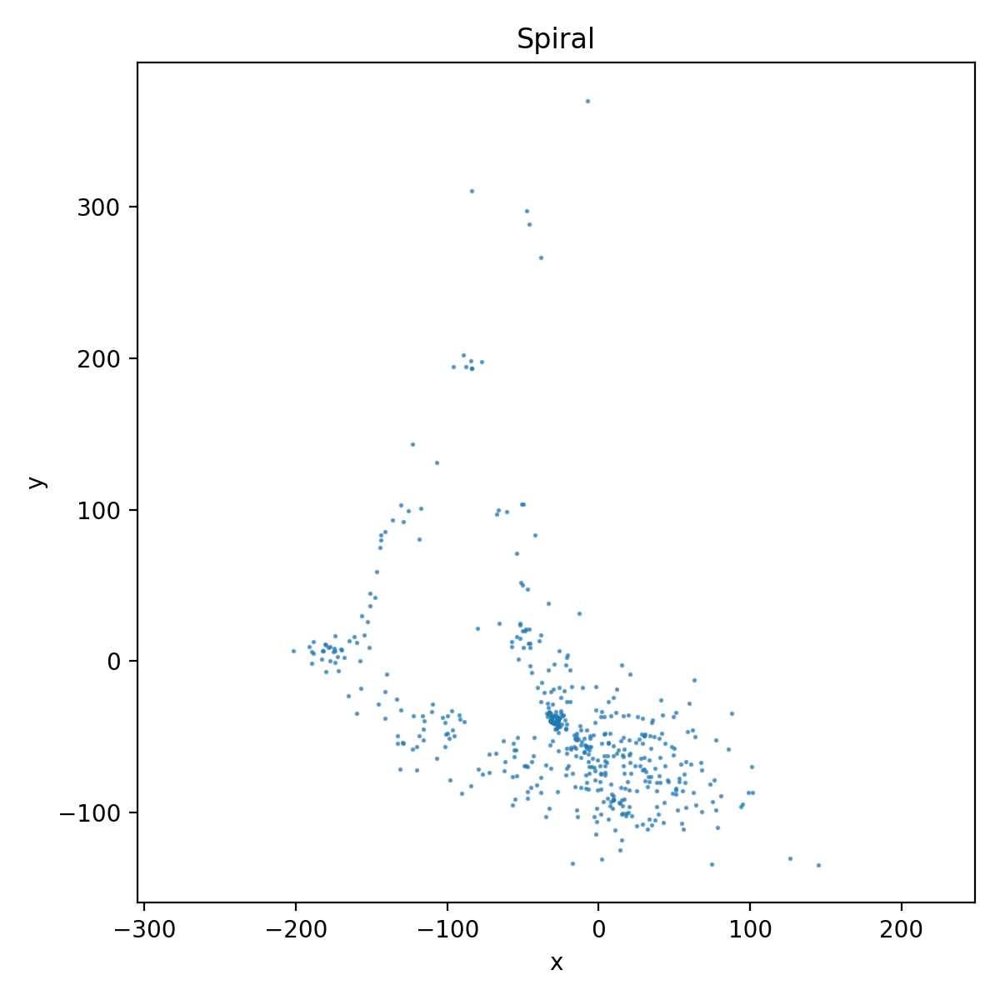
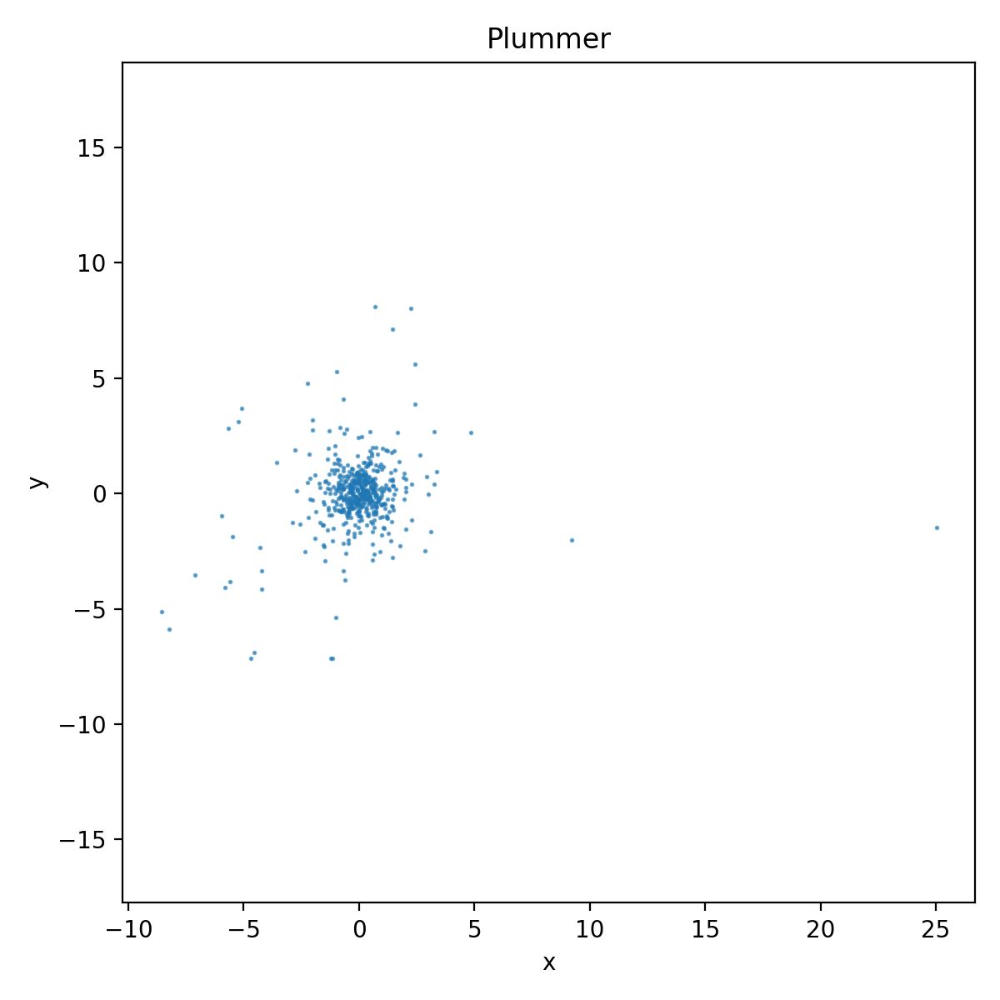
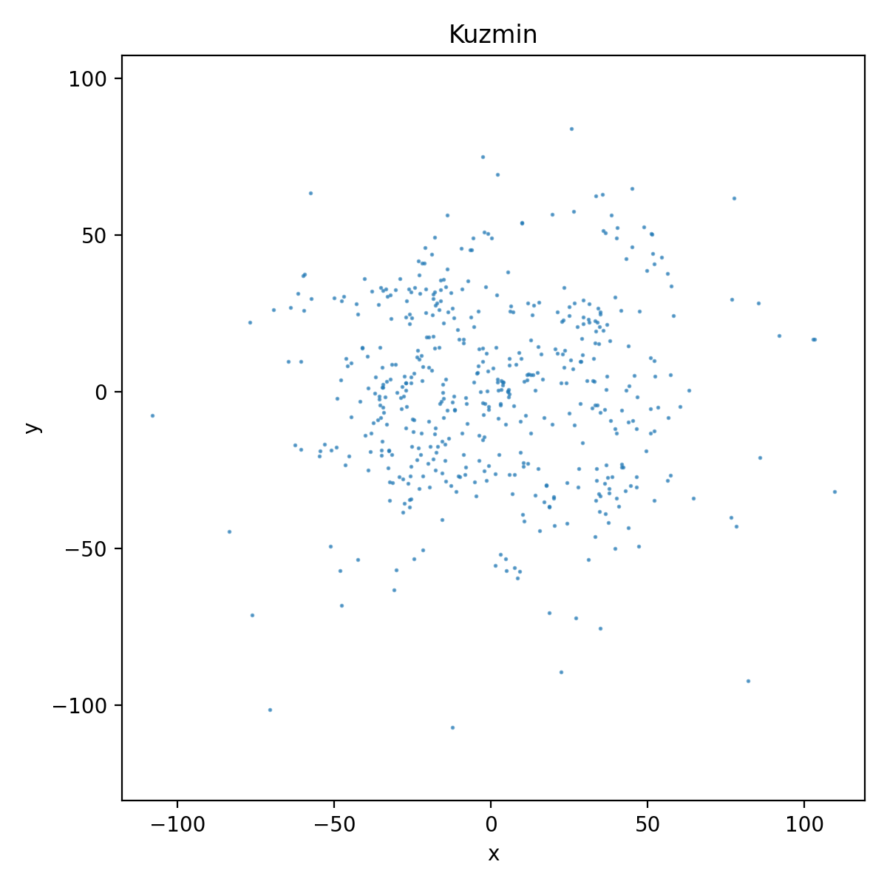
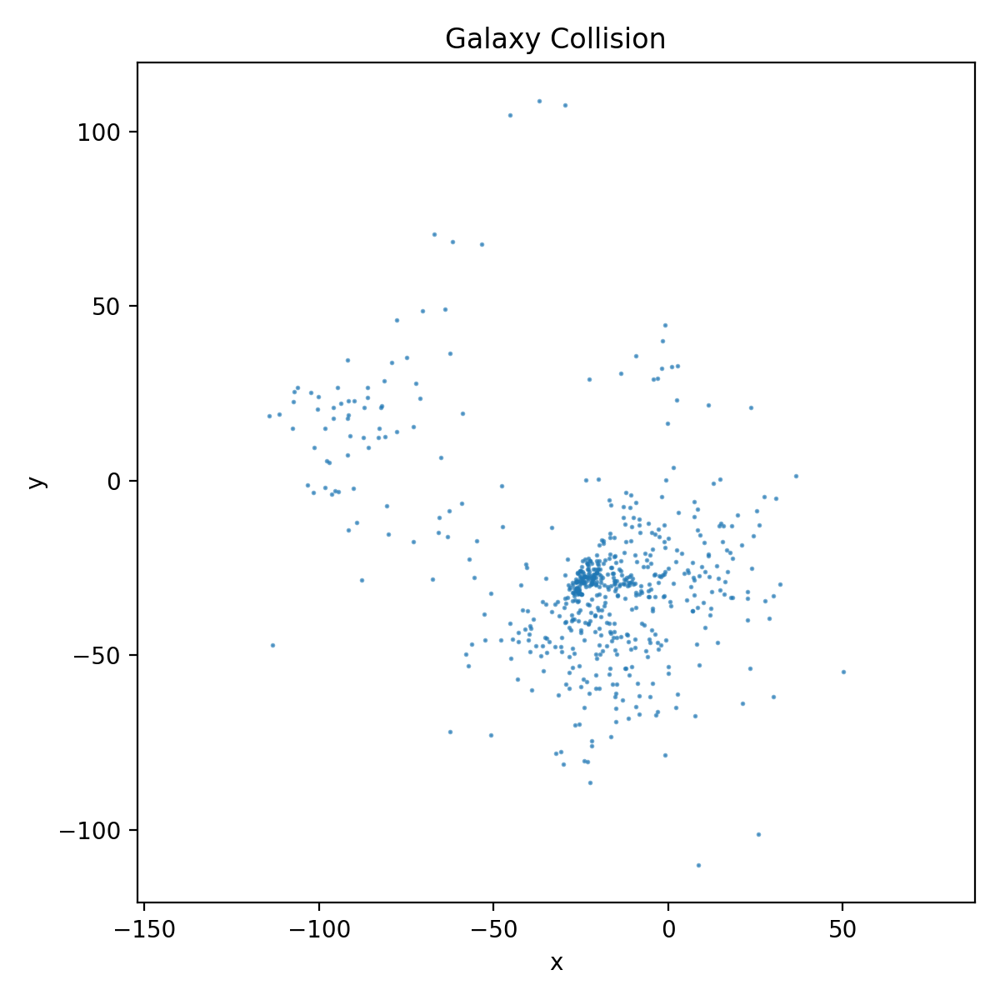

# Celestial Waltz

**Celestial Waltz** is a modular, extensible N‑body simulation toolkit for studying the
dynamics of self‑gravitating systems.  The project began as a simple spiral‑galaxy
simulator but has evolved to include multiple force solvers, integrators and
realistic initial conditions.  It offers both a headless API and an interactive
Tkinter GUI for exploring gravitational dynamics.

## Features at a glance

The table below summarises the core capabilities.  Short phrases are used to
highlight what you can do without overwhelming you with prose.

| Category           | Options/Notes |
|--------------------|---------------|
| **Force model**    | Barnes–Hut (O(N log N)), Direct (O(N²)) |
| **Integrators**    | Euler, Leapfrog, Runge–Kutta 4 (RK4) |
| **Initial conditions** | Spiral galaxy, Plummer sphere, Kuzmin disk, Two‑galaxy collision |
| **Visualisation**  | Tkinter GUI, Matplotlib 2D/3D plots, GIF/PNG recorder |
| **Acceleration**   | Multi‑threaded CPU, optional GPU via PyTorch |
| **Utilities**      | Benchmark script, image/gif generation, simple test suite |

These additions address several of the originally planned improvements such as
support for additional galaxy initialisers and higher‑order integrators【21345888516305†L146-L153】.  The
new initial condition generators draw inspiration from open‑source N‑body
projects that employ Monte‑Carlo samplings of the Plummer, Hernquist and
Kuzmin distributions to model realistic spherical and disk galaxies【463864940567552†L238-L243】.

## Gallery

The following snapshots illustrate what Celestial Waltz can produce out of the box.  Each
image was generated by running one of the provided scripts (see
`generate_images.py`).

| Simulation | Preview |
|-----------|---------|
| **Spiral Galaxy** |  |
| **Plummer Sphere** |  |
| **Kuzmin Disk** |  |
| **Galaxy Collision** |  |

The benchmark below compares the runtime scaling of the direct O(N²) solver to the
Barnes–Hut approximation.  Each point represents the average time per integration
step measured with the included `benchmark.py` script.


## Algorithm overview

### Newtonian gravity

Two bodies of mass $m_i$ and $m_j$ separated by a vector $\mathbf{r}_{ij}$ interact via
the gravitational force

$$
\mathbf{F}_{ij} = G\,\frac{m_i m_j}{\lVert\mathbf{r}_{ij}\rVert^3}\,\mathbf{r}_{ij},
$$

where $G$ is the gravitational constant.  A small softening parameter $\varepsilon$
is added to the denominator to avoid singularities when particles approach
very closely.  The total acceleration of each particle is the sum of
contributions from all others.

### Barnes–Hut approximation

Direct summation of forces scales as O(N²), which becomes expensive for large
particle counts.  The Barnes–Hut algorithm replaces distant groups of bodies by
a single pseudo‑particle located at the group’s centre of mass【463864940567552†L262-L270】.  A node of size $s$
at distance $d$ from a particle is approximated by its centre of mass when
$s/d<\theta$.  This hierarchical tree reduces the number of force
calculations to O(N log N) while retaining good accuracy.

### Integration schemes

Celestial Waltz implements three time‑stepping methods:

* **Euler** – simplest explicit method, fast but exhibits energy drift.
* **Leapfrog** – second‑order symplectic scheme that conserves energy much better.
* **Runge–Kutta 4** – a fourth‑order accurate integrator added in this release for
  higher precision.  It requires multiple force evaluations per step but is
  useful when accuracy is paramount.

### Initial condition generators

In addition to the original spiral galaxy, the library now includes functions
to build more realistic systems:

* **Plummer sphere** – isotropic, finite‑mass star cluster.  Radii are sampled
  according to the Plummer distribution and velocities are initialised for near
  circular orbits.
* **Kuzmin disk** – exponential disk with a small vertical thickness.  This is
  a simple model for thin rotating galaxies.
* **Two galaxies** – sets up a pair of spiral galaxies separated by a chosen
  distance and travelling towards each other to study collisions and mergers.

These generators draw inspiration from other open projects that employ
Monte‑Carlo sampling to create realistic spherical and disk galaxies【463864940567552†L238-L243】.

## Installation

The core simulation relies solely on the Python 3 standard library.  Optional
features require a few additional packages:

```bash
pip install matplotlib pillow torch
```

* `matplotlib` – used for plotting and the benchmark script.
* `pillow` – enables PNG/GIF output via the included recorder.
* `torch` – optional GPU acceleration for the `gpu_sim.py` script.

## Getting started

### Interactive GUI

The Tkinter interface allows you to tweak parameters on the fly and watch the
simulation evolve.  Run:

```bash
python3 galaxy_gui.py
```

You will see sliders for the particle count, time step and total iterations.
Press **Start** to run the simulation.  You can choose the integration method
and whether to use the Barnes–Hut or direct solver.

### Headless API

For programmatic access or running on servers, use the `BarnesHutSimulation`
class directly.  For example, to evolve a Plummer sphere using the RK4
integrator:

```python
from nbody import BarnesHutSimulation
sim = BarnesHutSimulation(num_particles=500,
                          dt=0.01,
                          mode="bh",
                          integrator="rk4",
                          initial="plummer")
sim.run(200)
```

Valid values for `initial` are `"spiral"`, `"plummer"`, `"kuzmin"` and
`"two_galaxies"`.  Integrators are `"euler"`, `"leapfrog"` and `"rk4"`.  Set
`mode="direct"` for a brute‑force solver.

### Benchmarking

To reproduce the performance figure above, execute

```bash
python3 benchmark.py
```

The script measures the average time per step for increasing particle counts and
writes a plot to `benchmark.png`.  Larger systems demonstrate the expected
O(N log N) vs O(N²) behaviour.

### Generating images

Run

```bash
python3 generate_images.py
```

to regenerate the gallery images.  The script evolves each initial condition
for a few hundred steps (except the Plummer sphere, which is shown at t=0) and
saves the scatter plots in the `images/` directory.

## GPU acceleration

If you have a CUDA‑capable GPU and [PyTorch](https://pytorch.org/) installed, try the
minimal GPU implementation:

```bash
python3 gpu_sim.py --particles 100000 --iterations 1000 --dt 0.01 --mode bh
```

Note that the GPU version is experimental; it offloads force computation to
PyTorch while retaining Python for orchestration.

## Contributing and future directions

Celestial Waltz aims to be an accessible sandbox for exploring gravitational
dynamics.  Possible extensions include:

* Additional density profiles (e.g., Hernquist, Navarro–Frenk–White).
* Self‑consistent treatment of particle masses and tidal interactions.
* Efficient GPU kernels for extremely large particle numbers.
* High‑level wrappers for interactive 3D visualisation (e.g., using
  `pyqtgraph` or `three.js`).

Pull requests are welcome!  Please ensure that new features are covered by
simple tests and documented clearly.